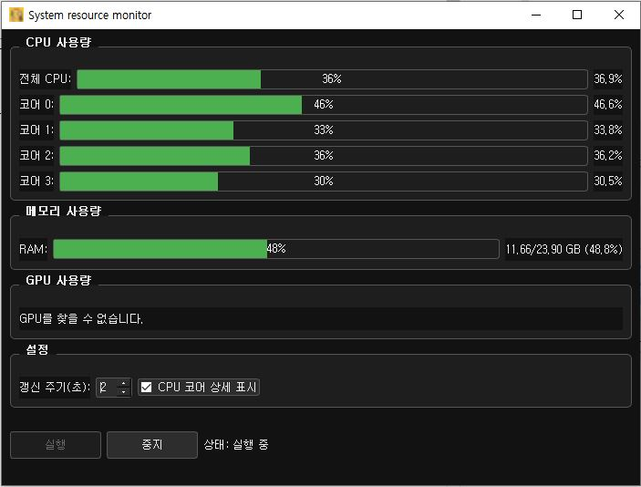

# 시스템 리소스 모니터

실시간 시스템 리소스(CPU, RAM, GPU) 모니터링을 위한 데스크톱 애플리케이션입니다.



## 주요 기능

- **CPU 모니터링**: 전체 및 개별 코어 사용량 실시간 추적
- **메모리(RAM) 모니터링**: 사용량, 총량, 사용 비율 표시
- **GPU 모니터링**: GPU 사용률, 메모리 사용량, 온도 실시간 추적
- **다크 테마**: 눈의 피로를 줄이는 어두운 인터페이스
- **사용자 설정**: 갱신 주기 조정, CPU 코어 표시 여부 설정
- **실행/중지 제어**: 모니터링 활성화 및 비활성화 기능

## 설치 방법


### 소스에서 설치

```bash
# 저장소 복제
git clone https://github.com/reinhardt0926/system-monitor.git
cd system-monitor

# 종속성 설치
pip install -e .

# 실행
python -m mnt_src.main
```

## 사용 방법

1. 애플리케이션을 실행합니다.
2. '실행' 버튼을 클릭하여 모니터링을 시작합니다.
3. 화면 하단의 설정 패널에서 갱신 주기를 조정할 수 있습니다.
4. CPU 코어 상세 정보 표시 여부를 토글할 수 있습니다.
5. '중지' 버튼을 클릭하여 모니터링을 일시 중지할 수 있습니다.

## 직접 빌드하기

### 필수 조건

- Python 3.8 이상
- pip
- 필수 패키지: psutil, GPUtil, PyQt5

### 빌드 과정

```bash
# 개발 종속성 설치
pip install -e ".[dev]"

# 빌드 스크립트 실행
python build.py
```

### 빌드 스크립트 (build.py)

`build.py` 스크립트는 배포 과정을 자동화하는 유틸리티입니다:

- 이전 빌드의 임시 파일 정리
- 필요한 리소스 디렉토리 확인
- 현재 운영체제에 맞는 빌드 설정 적용
- PyInstaller를 사용한 패키징 실행

이 스크립트를 실행하면 배포 준비가 완료된 실행 파일이 `dist/` 디렉토리에 생성됩니다.

## 기술 스택

- **Python**: 코어 프로그래밍 언어
- **PyQt5**: GUI 프레임워크
- **psutil**: 시스템 정보 수집
- **GPUtil**: GPU 정보 수집
- **PyInstaller**: 배포 가능한 실행 파일 생성

## 라이선스

이 프로젝트는 MIT 라이선스를 따릅니다. 자세한 내용은 [LICENSE](LICENSE) 파일을 참조하세요.

## 연락처

프로젝트 관리자 - [이메일 주소](mailto:reinhardt0926@gmail.com)
